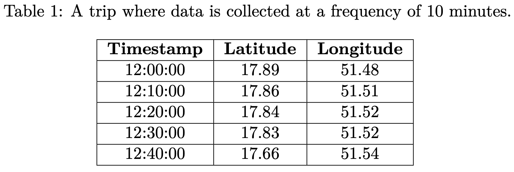
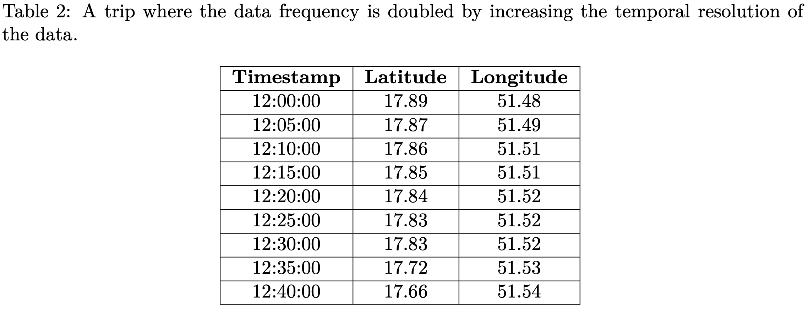
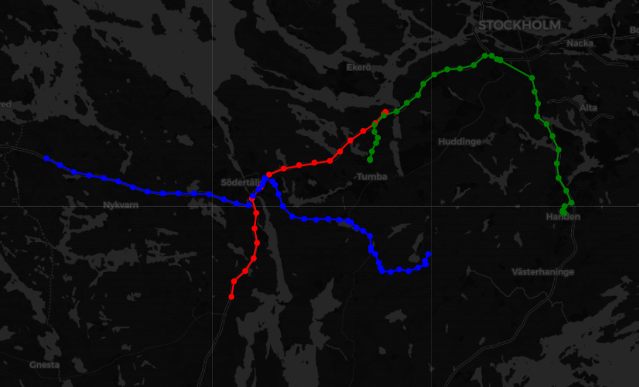
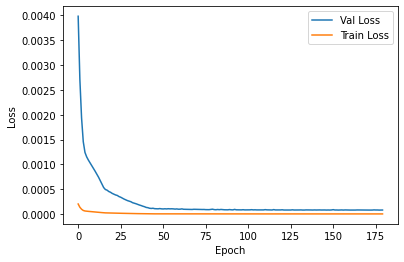
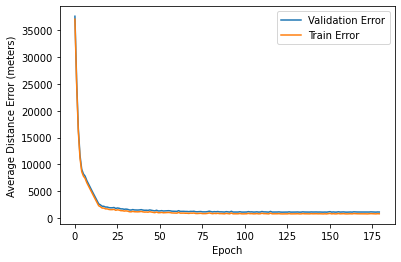
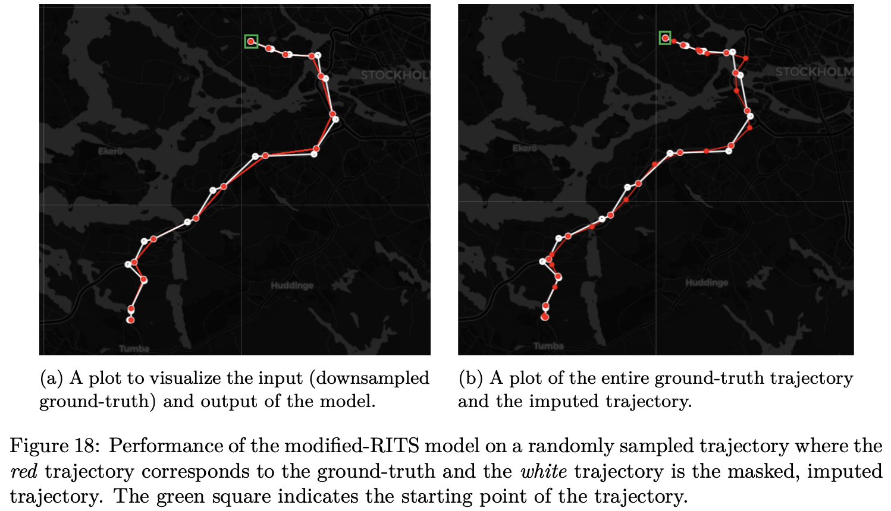
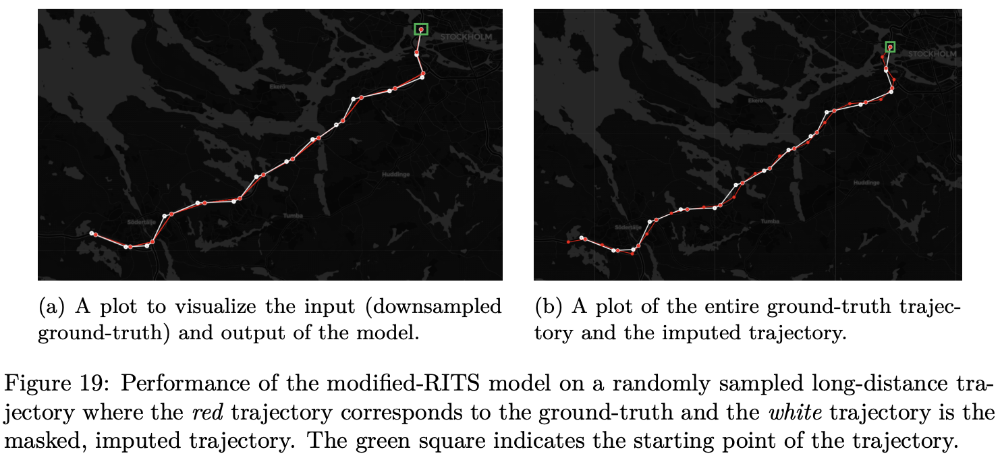

# Super-Resolution Vehicle Trajectory using Recurrent Time Series Imputation

This repository is a Master Thesis project conducted at Scania CV AB and Uppsala University, Sweden. The thesis publication can be found [here](http://urn.kb.se/resolve?urn=urn:nbn:se:uu:diva-478010).


## Aim

This thesis aims to increase the temporal resolution of the data (vehicle trips) using deep neural networks. Given a temporally ordered sequence of geospatial coordinates indicating a truck’s trajectory, the objective is to estimate the intermediate positions of the truck. Furthermore, the model should implicitly learn the actual road network and predict feasible positions of the truck. An example of a trip where a truck collects data every 10 minutes can be found in Table 1.

<p align="center">
    
</p>

The objective is to double the frequency of the data, i.e., to generate intermediate latitude and longitude values for the truck every 5 minutes, which can be found in Table 2.

<p align="center">
    
</p>


## Preprocessing

The `Preprocessor` class can be found [here](https://github.com/hasnainroopawalla/super-resolution-vehicle-trajectory/blob/master/geo_rits/preprocessor.py) and the preprocessing utilities can be found [here](https://github.com/hasnainroopawalla/super-resolution-vehicle-trajectory/blob/master/geo_rits/preprocessing_utils.py).

A few randomly sampled, preprocessed subtrips plotted on the map are shown below:

<p align="center">
    
</p>


## Results

### Training and Validation Error

<p align="center">
  
</p>

### Training and Validation Loss

<p align="center">
  
</p>

### Qualitative results

<p align="center">
  
</p>

<p align="center">
  
</p>

### Quantitative results

<p align="center">
  
</p>


## Instructions

1. Install the requirements
   ```
   $ pip install -r requirements.txt
   ```
2. Set the hyper-parameters in the [`Config`](https://github.com/hasnainroopawalla/super-resolution-vehicle-trajectory/blob/master/geo_rits/config.py) class. The final set of hyper-parameters used in this thesis are as follows:
   ```python
   class Config:
    model_name: str = "model"
    data_path: str = "data"
    traj_len: int = 30
    stride: int = 4
    traj_dist: int = 1000  # meters
    epochs: int = 500
    learning_rate: float = 1e-4
    batch_size: int = 128
    hid_dim: int = 100
    load_weights: bool = False
    checkpoint_freq: int = 10
    training: bool = True
   ```
3. Navigate to the `geo_rits` package
   ```
   $ cd geo_rits
   ```
4. Begin model training
   ```
   $ python3 train.py
   ```
5. The trained model can be found in the `models/` directory.

> An example of the input subtrips and masks can be found in the `data/` directory.


## Acknowledgments

The original publication of the `RITS` architecture- "BRITS: Bidirectional Recurrent Imputation for Time Series, Wei Cao, Dong Wang, Jian Li, Hao Zhou, Lei Li Yitan Li. (NerIPS 2018)" can be found [here](http://papers.nips.cc/paper/7911-brits-bidirectional-recurrent-imputation-for-time-series).

The TensorFlow implementation of the original `RITS` architecture used in this project can be found [here](https://github.com/SpyrosMouselinos/BRITSTF2).
